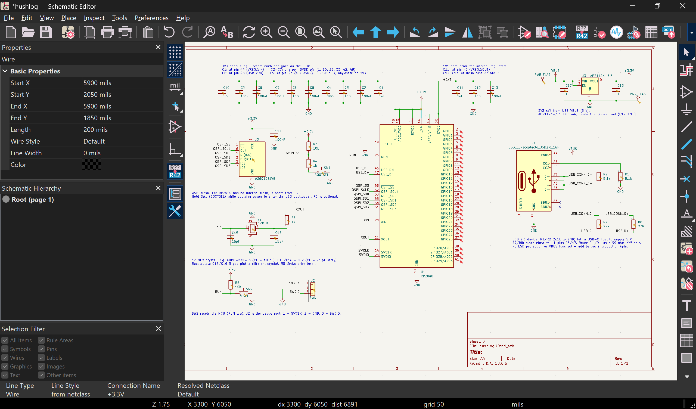
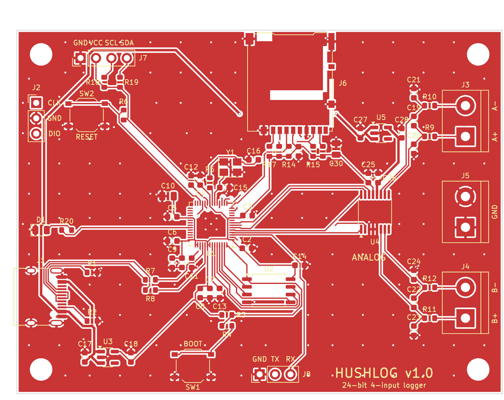
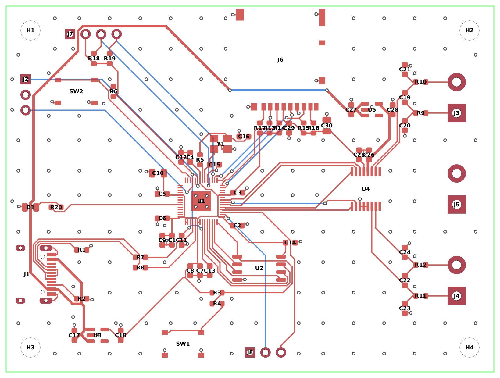

# Hushlog

A 4-channel, 24-bit data logger for small, slow signals — thermocouples, strain gauges, photodiodes, RTDs.

Most DIY loggers read tiny voltages with the microcontroller's built-in ADC, which is fine until the signal is small, at which point it's mostly noise. Hushlog uses a real 24-bit precision ADC (the TI ADS1220) with 4 input channels, read by a bare RP2040, logged to a microSD card, with a small OLED for live readings — all on a custom 2-layer board in a 3D-printed enclosure.

The thing I actually care about is keeping it **quiet**: a separate low-noise supply for the analog side, RC filtering on every input, and a layout that keeps the digital switching noise away from the ADC. Once it's built I'll short the inputs, measure the noise floor, and compare it to the datasheet — that number goes in this repo, good or bad.

## Status

Design in progress for the Hack Club Half Life warm-up (Tier 2).

- [x] RP2040 core schematic — MCU, external QSPI flash, 12 MHz crystal, USB-C + LDO power, BOOTSEL/RESET, SWD. Power rails verified (VREG_VIN confirmed on +3.3V).
- [x] ADS1220 analog front end — two differential channels, computed input filters, SPI on hardware SPI0, separate low-noise LDO (AVDD isolated from digital rail, verified)
- [x] microSD (SPI1), OLED header (I2C1), screw terminals, status LED, UART header
- [x] PCB layout — 80 × 60 mm, 2 layers, analog/digital split, ground pour on both sides. Passes DRC with 0 errors and 0 unrouted nets in KiCad 7's DRC engine; still to be re-checked in KiCad 10 before ordering.
- [ ] Enclosure (3D-printed)
- [ ] Firmware (RP2040 + ADS1220 + SD logging)

## Design choices

- **Bare RP2040, not a Pico module** — designing the MCU circuit from scratch (reference design followed pin-for-pin so it boots first try).
- **External QSPI flash (W25Q128)** — the RP2040 has no internal flash.
- **Separate analog supply** — the ADC gets its own low-noise LDO so RP2040 switching noise doesn't couple into the measurement.
- **2-layer board** — kept deliberately simple for a first build; no need for 4 layers at these speeds.

## PCB

- 80 × 60 mm, 2 layers, four M3 mounting holes. Minimum track and gap 0.2 / 0.15 mm, vias 0.6 / 0.3 mm.
- Digital on the left (RP2040, flash, USB-C, microSD, OLED header), analog on the right (ADS1220, input filters, screw terminals, analog LDO).
- The bottom layer under the analog section is unbroken ground: a rule area forbids bottom-layer tracks there, so nothing can cut the plane under the ADC or the input filters.
- The 5 V feed for the analog LDO runs around the board edge and passes under the microSD socket, where no signal crosses the gap it leaves in the plane. It never enters the input-filter area.
- Input pairs: J3 = IN_A (pin 1 AIN1, pin 2 AIN0), J4 = IN_B (pin 1 AIN3, pin 2 AIN2), J5 = ground. MUX settings 0110 and 0111 make pin 1 the positive input.
- Fabrication files are in `fab/` (Gerbers, drill, placement, parts list).

## Hardware

- `hardware/` — KiCad 10 project (schematic + PCB)
- `docs/` — schematic render, board images, noise-floor results
- `cad/` — enclosure files
- `firmware/` — RP2040 firmware

## Parts (headline)

| Part | Role |
|---|---|
| RP2040 | microcontroller |
| W25Q128 | QSPI boot flash |
| ADS1220 | 24-bit ADC (4 ch) |
| AP2112K-3.3 | 3.3V LDO (digital) |
| TPS7A20 | low-noise LDO (analog) |
| SSD1306 0.96" | OLED display |

Full bill of materials in `BOM.md` (auto-synced from the Half Life project).
